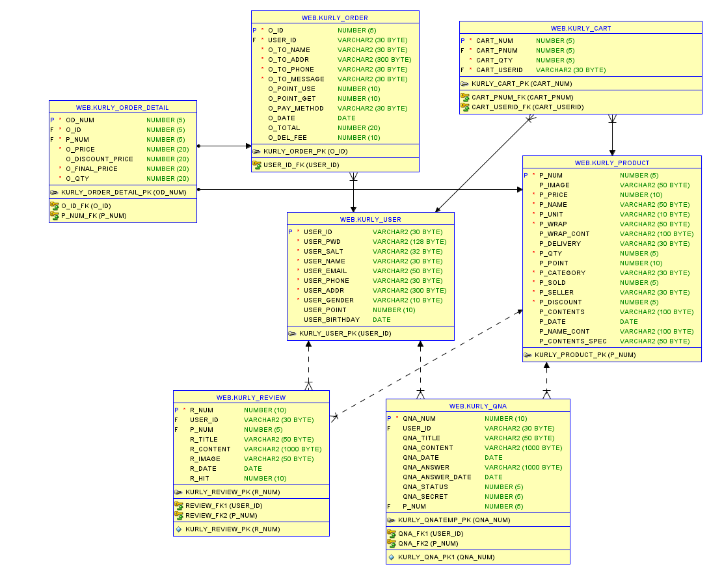

# MarketHani

## 🛒JSP 마켓컬리 클론코딩 : MarketHani  

 

 

'마켓하니'는 '샛별배송'으로 유명한 신선식품 판매사이트 '마켓컬리'를 클론코딩한 쇼핑몰 프로젝트입니다.

해당 프로젝트를 만들게 된 목적은 다음과 같습니다.

- 학원에서 배운 내용을 바탕으로 서비스에서 실제로 활용되는 기능을 구현
- 트렌드에 맞는 웹사이트의 구조와 UI를 프로젝트를 통해 학습
- 위의 조건을 만족하는 '마켓하니' 웹사이트의 전체적인 레이아웃을 참고하여 프로젝트 진행

 

## 1. 개요

- 프로젝트 기간: 2021/11/18 ~ 2021/12/8

- 팀원: 안승욱, 허민회, 조재연, 노지수

- Stack
    - Language : Java 1.8
    - Database : Oracle 18c
    - Library : JSP/Servlet, jQuery
    - Server : Apache Tomcat 9.0
    - HTML5, CSS3, JavaScript, 
    - IDE : Eclipse, Visual Studio Code
    - 협업 툴 : Git, Github, Google Docs

 

## 2. 주요 기능

- 메인화면

- 헤더 / 푸터 : 드롭다운메뉴

- 로그인 / 회원가입
    - 'SHA-256' 해시 알고리즘을 통한 비밀번호 암호화
    - 정규식을 사용하여 사용자 입력 값 유효성 검사
    - AJAX를 활용한 ID 중복확인

- 상품목록 / 상품 상세페이지

- 장바구니, 주문 / 결제

- 마이페이지

 

## 3. ERD

마켓하니의 DB 테이블은 7개로 구성되어있으며, ERD는 다음과 같습니다.

 

ERD보기
 
 

 

